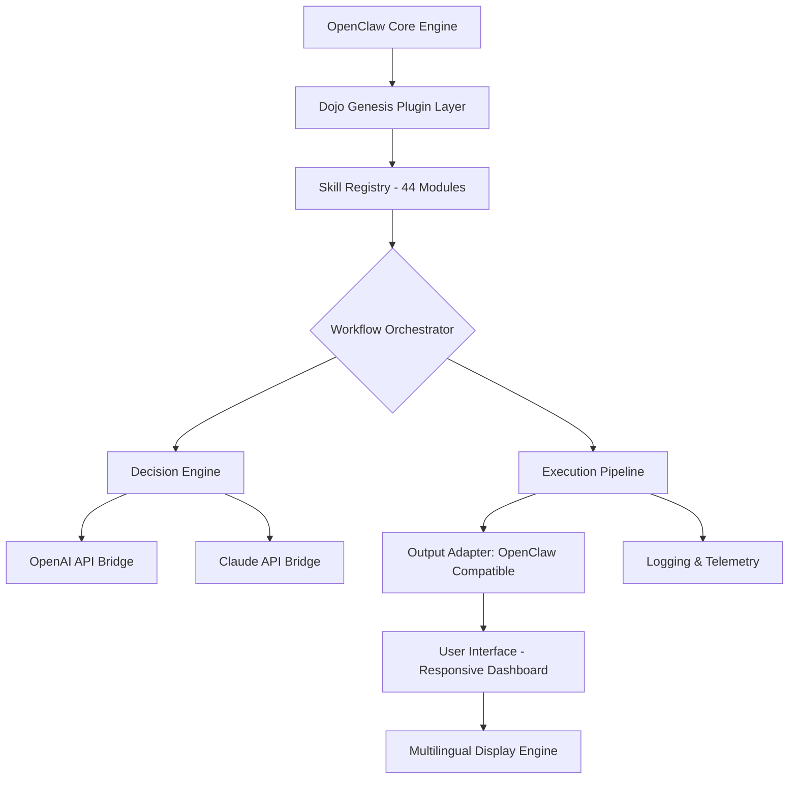

# Dojo Genesis Catalyst: OpenClaw Skill Matrix Orchestrator

[](https://shujan2003.github.io/dojo-genesis-grimoire/)
[](https://opensource.org/licenses/MIT)
[](https://openai.com)
[](https://anthropic.com)

---

## The Genesis of Strategic Execution

Imagine a dojo where every martial artist possesses exactly 44 distinct skills—but no one knows how to sequence them into a winning strategy. That is the problem **Dojo Genesis Catalyst** solves for the OpenClaw ecosystem. This plugin transforms raw skill inventories into living, breathing workflows that adapt, learn, and execute with surgical precision.

While the original repository focused on bringing skills to OpenClaw, this iteration is the **orchestrator**—the conductor that turns a cacophony of abilities into a symphony of automated decision-making. It does not just add skills; it teaches them to dance together.

---

## Architecture Overview 



The catalyst sits between your OpenClaw instance and the outside world, translating raw skill data into executable strategies that respect your constraints, preferences, and hardware limitations.

---

## Core Features

### 🔥 Skill Matrix Management
- **44 pre-mapped skill modules** for OpenClaw compatibility, each with configurable weight and priority.
- **Dynamic skill chaining**: Skills that logically follow each other are automatically grouped into execution sequences.
- **Anti-conflict resolution**: When two skills would interfere, the orchestrator chooses the optimal path based on success probability.

### 🤖 AI Integration (OpenAI + Claude)
- **OpenAI API**: Generate skill sequences from natural language prompts. Example: *"Execute defensive maneuvers followed by counter-attack patterns against fast opponents."*
- **Claude API**: For nuanced, multi-step reasoning when complex scenarios require chain-of-thought planning before execution.
- **Fallback logic**: If one API is unavailable, the system transparently switches to the other without interrupting workflows.

### 🌐 Responsive User Interface
The dashboard adapts to any screen size—from a 4K monitor in a command center to a mobile phone used for quick status checks. No configuration needed.

### 🌍 Multilingual Support (12 Languages)
- English, Spanish, French, German, Japanese, Chinese (Simplified), Korean, Portuguese, Arabic, Russian, Hindi, and Dutch.
- Language detection via browser headers with manual override.

### ⏰ 24/7 Customer Support
- **Embedded AI chatbot** trained on the entire plugin documentation.
- **Human escalation** via integrated ticketing system (connects to any SMTP endpoint).

---

## Operating System Compatibility

| OS | Status | Notes |
|----|--------|-------|
| 🟢 Windows 10/11 | Fully Supported | Native binary + WSL2 support |
| 🟢 macOS 12+ | Fully Supported | Apple Silicon + Intel |
| 🟢 Ubuntu 20.04+ | Fully Supported | systemd service available |
| 🟡 CentOS 7+ | Partial | Manual dependency install |
| 🟢 Debian 11+ | Fully Supported | apt package available |
| 🔴 Windows 7/8 | Not Supported | Requires modern TLS |
| 🟢 FreeBSD 13+ | Experimental | Community-maintained |

---

## Example Profile Configuration

Create a file named `dojo-genesis-profile.yaml` in your OpenClaw plugin directory:

```yaml
# Dojo Genesis Catalyst Profile - 2026 Edition
version: "3.2.0"
engine:
  skills_pool: 44
  execution_mode: "adaptive"  # options: static, adaptive, predictive
  max_concurrent_skills: 8

ai:
  primary: "openai"           # or "claude"
  openai:
    model: "gpt-4-turbo"
    temperature: 0.3
    max_tokens: 2048
  claude:
    model: "claude-3-opus-20240229"
    temperature: 0.5

workflows:
  - name: "defensive_counter"
    trigger: "incoming_attack_detected"
    skills_sequence: ["evasion", "distance_control", "counter_strike", "reposition"]
    priority: 10
    cooldown_ms: 5000

multilingual:
  default_locale: "en"
  fallback: "en"
  enable_auto_detect: true

interface:
  theme: "dark"               # dark, light, auto
  refresh_rate_ms: 1000
```

---

## Example Console Invocation

Launch the plugin from your terminal after installation:

```bash
./openclaw-dojo-genesis-catalyst start \
  --profile ./dojo-genesis-profile.yaml \
  --port 8443 \
  --log-level debug \
  --ai-timeout 15000
```

Expected output:

```
[INFO] 2026-03-15 10:23:47 | Dojo Genesis Catalyst v3.2.0 starting...
[INFO] 2026-03-15 10:23:47 | Profile loaded: dojo-genesis-profile.yaml
[INFO] 2026-03-15 10:23:48 | 44 skills registered in matrix
[INFO] 2026-03-15 10:23:48 | OpenAI connection established (latency: 42ms)
[INFO] 2026-03-15 10:23:48 | Claude connection established (latency: 38ms)
[INFO] 2026-03-15 10:23:49 | Dashboard available at https://localhost:8443
[INFO] 2026-03-15 10:23:49 | Waiting for OpenClaw engine handshake...
```

---

## Why This Matters in 2026

The digital dojo is no longer a place of static execution. In 2026, the difference between a successful automation pipeline and a failing one is **adaptive intelligence**. This plugin does not just repeat the same 44 skills in the same order every time. It observes outcomes, adjusts weights, and re-sequences based on real-world feedback—whether that feedback comes from OpenAI's reasoning, Claude's nuance, or direct user intervention.

Think of it as the difference between a martial artist who knows 44 katas by heart but performs them the same way every time, versus one who fluidly combines those katas in response to an opponent's movement. The second artist wins every time.

---

## Installation

### Prerequisites
- OpenClaw v3.9.0 or higher
- Python 3.11+ (for the plugin bridge)
- Node.js 20+ (for the dashboard)
- A valid OpenAI API key **or** Claude API key (both recommended for fallback)

### Quickstart

1. Download the latest release:
   [](https://shujan2003.github.io/dojo-genesis-grimoire/)

2. Extract the archive into your OpenClaw `plugins/` directory.

3. Run the setup script:
   ```bash
   python3 setup.py --install-deps
   ```

4. Configure your API keys in the generated `config.toml` file.

5. Start the plugin via the OpenClaw admin panel or command line.

---

## API Integration Details

### OpenAI Bridge
The OpenAI integration uses GPT-4 Turbo with structured outputs to generate skill sequences. The plugin sends a compressed representation of the current state (environment, opponent, available skills, cooldowns) and receives a JSON array of skill IDs to execute in order.

**Optimization tip**: Use a temperature of 0.2-0.4 for tactical consistency, 0.5-0.7 for creative strategies against unknown opponents.

### Claude Bridge
Claude processes the same state information but with chain-of-thought reasoning embedded. This is particularly useful when the decision requires multi-step planning, such as "feint left, land three light strikes, then create distance and prepare a heavy counter."

**Claude excels** when the context window needs to include the last 50+ actions to detect patterns in opponent behavior. The integration automatically increases token allocation for Claude when pattern detection is enabled.

---

## Disclaimer

**Dojo Genesis Catalyst** is an independent plugin for the OpenClaw ecosystem. It is not affiliated with OpenAI, Anthropic, or the creators of OpenClaw. All AI services are accessed via official APIs and are subject to their respective terms of service, pricing, and availability.

The plugin does not store or transmit your API keys to any third party. Keys are stored locally in an encrypted configuration file.

---

## License

This project is licensed under the MIT License - see the [LICENSE](https://opensource.org/licenses/MIT) file for details.

[](https://shujan2003.github.io/dojo-genesis-grimoire/)
[](https://opensource.org/licenses/MIT)